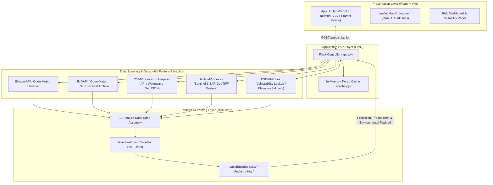

# SafeLand 🌊

**AI-Based Flood Risk & Construction Suitability Assessment System for Kerala**

SafeLand helps individuals, civil engineers, and prospective land buyers evaluate flood hazard before purchasing property or building a home. Rather than relying on anecdotal accounts or memory of past monsoons, SafeLand leverages satellite observations, topographic analysis, hydrological data, and machine learning to deliver a real-time, data-backed risk assessment for any location in Kerala.

---

## Table of Contents

- [The Problem](#the-problem)
- [How It Works](#how-it-works)
- [System Architecture](#system-architecture)
- [Feature Engineering (13 Real-Time Features)](#feature-engineering-13-real-time-features)
  - [Why Synthetic Aperture Radar (SAR)?](#why-synthetic-aperture-radar-sar)
- [Machine Learning Pipeline](#machine-learning-pipeline)
  - [Dataset Generation & Label Refinement](#dataset-generation--label-refinement)
  - [Model Architecture & Hyperparameters](#model-architecture--hyperparameters)
  - [Model Evaluation & Feature Importance](#model-evaluation--feature-importance)
- [Engineering Highlights](#engineering-highlights)
- [Frontend & Risk Dashboard](#frontend--risk-dashboard)
- [API Reference](#api-reference)
- [Tech Stack](#tech-stack)
- [Getting Started](#getting-started)
  - [Prerequisites](#prerequisites)
  - [Development Setup (Decoupled)](#development-setup-decoupled)
  - [Production Setup (Unified Build)](#production-setup-unified-build)
- [Future Work](#future-work)
- [License & Acknowledgments](#license--acknowledgments)

---

## The Problem

Kerala is vulnerable to extreme precipitation and flash inundation, as evidenced by catastrophic flood events in 2018, 2019, and 2021. The state's unique geography — steep Western Ghats mountains rapidly sloping down through midlands to low-lying coastal plains, laced with 44 rivers — creates complex hydrological dynamics.

Prospective homebuyers, builders, and urban planners often lack access to localized, plot-level flood risk information. SafeLand automates spatial data collection and machine learning evaluation into a single, interactive map interface.

---

## How It Works

1. **Location Selection:** Pick any point on the interactive Leaflet map or enter precise GPS coordinates (Latitude & Longitude).
2. **Automated Feature Retrieval:** SafeLand gathers 13 environmental, hydrological, and satellite-derived features for that specific point (elevation, slope, river proximity, drainage density, rainfall patterns, KSDMA hazard zone, and multi-year SAR satellite flood history).
3. **ML Prediction & Suitability Scoring:** A trained Random Forest classifier infers the risk class (**Low**, **Medium**, or **High**) with class probabilities. A rule-based Construction Suitability Score (0–100) is calculated alongside practical recommendations aligned with building guidelines.

---

## System Architecture



| Component | Technology | Responsibility |
|---|---|---|
| **Frontend** | React 18, TypeScript, Vite, Tailwind CSS, Framer Motion, Leaflet | Interactive coordinate selection, reverse geocoding via OSM Nominatim, animated slide-over risk dashboard. |
| **API Controller** | Python, Flask, Flask-CORS | Exposes `/predict` and `/health`, coordinates data retrieval, formats responses, and serves static production assets. |
| **Caching Layer** | Python (`functools.wraps`) | In-memory tiered key-value caching (30-day expiry for static terrain/rasters; 7-day for weather/OSM). |
| **Geospatial Processing** | `rasterio`, `shapely`, GeoJSON | Raster neighbourhood lookups (3×3 pixel window), waterway distance searches, drainage density calculations. |
| **Machine Learning** | `scikit-learn`, `joblib` | Multi-class Random Forest classifier trained on 12,000 spatial samples across Kerala. |

---

## Feature Engineering (13 Real-Time Features)

For every coordinate evaluation, the backend synthesizes **13 features** that match the exact schema used during model training:

| # | Feature Column | Data Source / Method | Description & Significance |
|---|---|---|---|
| 1 | `latitude` | User input / Map click | Latitude coordinate within Kerala bounds (`8.0°N – 13.0°N`). |
| 2 | `longitude` | User input / Map click | Longitude coordinate within Kerala bounds (`74.5°E – 77.5°E`). |
| 3 | `flooded_2018` | Sentinel-1 SAR 2018 GeoTIFF raster | Binary flag (`1`/`0`) indicating inundation during the August 2018 megaflood. |
| 4 | `flooded_2019` | Sentinel-1 SAR 2019 GeoTIFF raster | Binary flag (`1`/`0`) indicating inundation during the 2019 monsoon floods. |
| 5 | `flooded_2021` | Sentinel-1 SAR 2021 GeoTIFF raster | Binary flag (`1`/`0`) indicating inundation during the October/November 2021 floods. |
| 6 | `flood_history_count` | Sum of 2018, 2019, and 2021 flood flags | Total observed flood inundations across historical events (integer `0` to `3`). |
| 7 | `ksdma_zone` | KSDMA hazard polygons / Elevation fallback | Vulnerability zone rating (`1` = Very Low to `5` = Very High / Coastal). |
| 8 | `elevation` | Open-Meteo Elevation API (Bhuvan CartoDEM proxy) | Ground elevation above mean sea level (meters). Low-lying terrain pools water. |
| 9 | `slope` | 4-point elevation sampling (N/S/E/W at ~500m offset) | Terrain gradient in degrees (`0°–90°`) computed via arctangent of maximum gradient. |
| 10 | `river_distance` | OSM Overpass API / Waterway network GeoJSON | Perpendicular distance to the nearest river or stream in kilometers (within 10 km). |
| 11 | `drainage_density` | OSM waterway vector density (1 km radius) | Local waterway density normalized to a `0.0 – 1.0` scale. |
| 12 | `annual_rainfall_mm` | Open-Meteo Archive (ERA5 climate reanalysis) | 5-year average annual precipitation in millimeters. |
| 13 | `extreme_rain_events` | Open-Meteo Archive (ERA5 climate reanalysis) | Count of days with extreme precipitation (>100 mm in 24 hours) over 5 years. |

> **Operational Fallback Notice:**
> - While SafeLand is architected to interface with ISRO Bhuvan CartoDEM and IMD gridded products, public REST access to these services is restricted. The production pipeline uses Open-Meteo's elevation API and ERA5 historical archive proxy.
> - If `ksdma_flood_zones.geojson` is not present, `ksdma_zones.py` applies a calibrated elevation-tiered fallback model (`<10m` → Zone 5, `<30m` → Zone 4, `<60m` → Zone 3, `<100m` → Zone 2, `≥100m` → Zone 1).

### Why Synthetic Aperture Radar (SAR)?

Optical satellite imagery (e.g., Landsat, Sentinel-2) is ineffective during monsoon crises due to persistent, heavy cloud cover. Furthermore, major flood peaks frequently occur during storm nights.

Sentinel-1's active C-band Synthetic Aperture Radar (SAR) emits microwave radar pulses that penetrate cloud decks, rain, and darkness:
- **Specular Reflection:** Smooth, standing floodwaters reflect radar pulses away from the sensor like a mirror, appearing as stark black/dark pixels.
- **Backscatter:** Rough dry land, vegetation, and urban infrastructure scatter pulses back to the satellite, appearing bright.

Using pre-processed Sentinel-1 SAR flood extent rasters from the 2018, 2019, and 2021 disasters provides ground-truth empirical flood footprints for training and inference.

---

## Machine Learning Pipeline

### Dataset Generation & Label Refinement

The dataset (`scripts/rebuild_training_data.py`) was synthesized from historical flood rasters and environmental layers:
1. **Multi-Year Raster Stacking:** Aligned binary flood rasters for 2018, 2019, and 2021 into an accumulated frequency map (`0` to `3` flood occurrences per pixel).
2. **Balanced Spatial Sampling:** 12,000 coordinate points sampled across Kerala, balanced evenly across baseline tiers:
   - **4,000 Low-Risk Samples:** Selected from points with `flood_history_count == 0`.
   - **4,000 Medium-Risk Samples:** Selected from points with `flood_history_count == 1`.
   - **4,000 High-Risk Samples:** Selected from points with `flood_history_count >= 2`.
3. **Environmental Label Refinement:** Pure flood counts can overlook areas that were fortunate during specific events despite severe environmental vulnerability. Labels were upgraded using deterministic environmental safeguards:
   - **Low → Medium:** If `elevation < 10m` AND (`ksdma_zone >= 4` OR `annual_rainfall_mm > 3500mm`).
   - **Medium → High:** If `flood_history_count >= 1` AND `elevation < 15m` AND `ksdma_zone >= 4` AND `annual_rainfall_mm > 3500mm`.

### Model Architecture & Hyperparameters

- **Classifier:** `RandomForestClassifier` (`scikit-learn`)
- **Parameters:**
  ```python
  RandomForestClassifier(
      n_estimators=200,
      max_depth=15,
      min_samples_split=10,
      min_samples_leaf=5,
      random_state=42,
      n_jobs=-1
  )
  ```
- **Rationale:** Tabular geospatial features exhibit nonlinear threshold interactions (e.g., low elevation + high rainfall + close river distance). Random Forests manage these interactions naturally without feature normalization, resist overfitting on spatial clusters, and execute fast inference on CPU instances.

### Model Evaluation & Feature Importance

On an 80/20 train/test split of the refined 12,000-sample dataset:

```
              precision    recall  f1-score   support
        High       1.00      1.00      1.00       791
         Low       1.00      1.00      1.00       776
      Medium       1.00      1.00      1.00       833
    accuracy                           1.00      2400
```

> **Note on Accuracy:** The ~100% accuracy on the test set is expected because the target categories were synthesized directly from multi-year flood frequency tiers and environmental upgrade rules, and the model is provided with the exact multi-year flood indicators as input features.

#### Feature Importances in the Trained Model:

```
  flood_history_count   : 0.4515  ██████████████████████
  flooded_2019          : 0.1763  ████████
  flooded_2018          : 0.1737  ████████
  flooded_2021          : 0.0877  ████
  river_distance        : 0.0322  █
  longitude             : 0.0301  █
  latitude              : 0.0170  
  annual_rainfall_mm    : 0.0159  
  drainage_density      : 0.0078  
  extreme_rain_events   : 0.0049  
  elevation             : 0.0021  
  ksdma_zone            : 0.0007  
  slope                 : 0.0001  
```

- Multi-year flood footprint flags (`flood_history_count`, `flooded_2019`, `flooded_2018`, `flooded_2021`) constitute over 88% of the model's split decisions.
- Hydrological proximity (`river_distance`) and geographic coordinates (`longitude`, `latitude`) represent the secondary physical decision boundaries.

---

## Engineering Highlights

1. **Grid-Snapped ERA5 Climate Caching (98% API Call Reduction):**
   - Querying 5 years of daily rainfall for 12,000 distinct coordinates would exceed API rate limits (HTTP 429).
   - In `scripts/download_kerala_rainfall.py`, coordinates are snapped to the nearest 0.25° ERA5 grid cell (`(coord / 0.25).round() * 0.25`).
   - This collapsed 12,000 spatial points across Kerala into just **228 unique grid cells**, cached to disk as a lookup table.
2. **Tiered Function Caching Decorator (`cache.py`):**
   - Implements `@cache_result` with SHA/argument hashing and configurable TTLs:
     - **30 Days (720 hours):** Static physical features (elevation, slope, SAR raster values, KSDMA zones).
     - **7 Days (168 hours):** Waterway lookups and weather statistics.
   - Repeated queries for identical or nearby points return in sub-millisecond times.
3. **NumPy-Vectorized Haversine Distance Search:**
   - Finding the nearest waterway for 12,000 points against tens of thousands of OpenStreetMap waterway nodes via standard loops would take hours.
   - A vectorized Haversine function bounded by a `±0.5°` latitude/longitude spatial pre-filter reduced batch calculation to seconds.
4. **Sub-Pixel Neighbourhood Tolerance (3×3 Window):**
   - Due to GPS imprecision or coordinate-raster boundary alignment, a single-point lookup could miss a flood boundary by meters.
   - `SentinelProcessor` inspects a 3×3 pixel window (`SEARCH_RADIUS_PX = 3`) around the target coordinate to ensure robust hazard detection.

---

## Frontend & Risk Dashboard

Built with **React 18**, **Vite**, **TypeScript**, **Tailwind CSS**, and **Framer Motion**:

- **Map Interaction:** Interactive Leaflet map with dark CARTO tiles, bounded to Kerala (`[8.0, 74.5]` to `[13.0, 77.5]`) with interactive ripple click animations.
- **Reverse Geocoding:** Calls the OSM Nominatim API to display the local panchayat/village, town, and district name for the clicked location.
- **Construction Suitability Score (0–100):**
  Combines model confidence and site physics into an intuitive composite score:
  $$\text{Score} = 0.5 \times (100 - P_{\text{High}}) + 0.25 \times \text{ElevationScore} + 0.25 \times \text{RiverDistanceScore}$$
- **Three-Tier Actionable Guidance:**
  - 🟢 **Low / Suitable (Score ≥ 70):** Site remained clear through major flood events. Standard construction approved; verify normal panchayat building permits.
  - 🟡 **Medium / Conditional (Score 40–69):** Recommend raising the plinth level by at least 0.6 m above adjacent road level (NBC 2016 guideline), conduct soil permeability testing, install dedicated plot perimeter drainage, and check local KSDMA clearance.
  - 🔴 **High / Avoid (Score < 40):** Land has flooded repeatedly; high risk of structure and asset damage. Construction strongly discouraged; DTCP and local authority restrictions likely apply.

---

## API Reference

### 1. `POST /predict`
Evaluates coordinates and returns risk assessment, environmental metrics, and flood history.

**Request Payload:**
```json
{
  "latitude": 9.9312,
  "longitude": 76.2673
}
```

**Optional Overrides (for testing specific flood scenarios):**
```json
{
  "latitude": 9.9312,
  "longitude": 76.2673,
  "flooded_2018": 1,
  "flooded_2019": 0,
  "flooded_2021": 0
}
```

**Success Response (`200 OK`):**
```json
{
  "location": {
    "latitude": 9.9312,
    "longitude": 76.2673
  },
  "environmental_data": {
    "elevation": 4.0,
    "rainfall": 3120.5,
    "soil_moisture": 42.0,
    "water_level": 14,
    "river_distance": 0.85
  },
  "historical_floods": {
    "2018": true,
    "2019": false,
    "2021": false,
    "total_count": 1
  },
  "flood_risk": "Medium",
  "confidence": {
    "High": 5.0,
    "Low": 15.0,
    "Medium": 80.0
  }
}
```

### 2. `GET /health`
Returns backend health status, model load status, and expected feature column names.

**Response (`200 OK`):**
```json
{
  "status": "Backend is running",
  "model_loaded": true,
  "features_expected": [
    "latitude", "longitude", "flooded_2018", "flooded_2019", "flooded_2021",
    "flood_history_count", "ksdma_zone", "elevation", "slope",
    "river_distance", "drainage_density", "annual_rainfall_mm", "extreme_rain_events"
  ]
}
```

---

## Tech Stack

- **Frontend:** React 18, TypeScript, Vite, Tailwind CSS, Framer Motion, Lucide React, Leaflet, React-Leaflet
- **Backend API:** Python 3, Flask, Flask-CORS, Gunicorn
- **Machine Learning:** scikit-learn, joblib, pandas, NumPy
- **Spatial & GIS Libraries:** rasterio, shapely
- **Data Providers & Proxies:** Open-Meteo (Elevation & ERA5 Climate Archive), OpenStreetMap / Overpass API, Sentinel-1 SAR (ESA)

---

## Getting Started

### Prerequisites
- Python 3.10+
- Node.js 18+ and npm
- GDAL/GEOS dependencies (for rasterio/shapely on specific platforms)

### Development Setup (Decoupled)

#### 1. Backend Setup
```bash
# From repository root
cd backend
python -m venv venv

# Windows:
.\venv\Scripts\activate
# Linux/macOS:
source venv/bin/activate

pip install -r requirements.txt
python app.py
```
*The Flask API will run on `http://127.0.0.1:5000`.*

#### 2. Frontend Setup
```bash
# In a separate terminal, from repository root
cd app
npm install
npm run dev
```
*The Vite development server will launch on `http://localhost:5173`.*

---

### Production Setup (Unified Build)

In production (e.g., Render, Railway, or VPS), Flask can serve the compiled React SPA directly:

```bash
# 1. Build the frontend assets
cd app
npm install
npm run build
cd ..

# 2. Install backend dependencies
pip install -r requirements.txt

# 3. Start the production server via Gunicorn
gunicorn --bind 0.0.0.0:5000 --timeout 120 backend.app:app
```
*Access the complete application at `http://localhost:5000`.*

---

## Future Work

- **Live Meteorological Alerts:** Connect with IMD nowcasting and Central Water Commission (CWC) dam discharge telemetry for real-time flash flood warnings.
- **Persistent Distributed Caching:** Transition the in-memory cache to Redis for horizontally scaled container deployments.
- **Interactive Inundation Depth Simulation:** Incorporate digital surface models (DSM) and hydrodynamic flow routing to simulate flood depth under varying 24-hour rainfall scenarios.

---

## License & Acknowledgments

This project is open source and available under the [MIT License](LICENSE).

Satellite rasters derived from Copernicus Sentinel-1 data (ESA). Map data © [OpenStreetMap](https://www.openstreetmap.org/copyright) contributors. Weather and elevation data powered by [Open-Meteo](https://open-meteo.com/).
